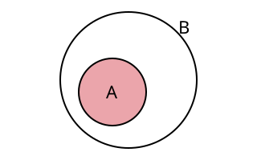
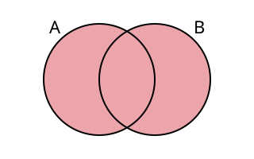
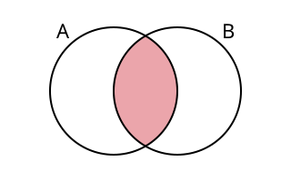
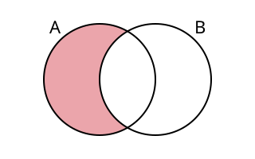

## Die Zahlenmengen {#sec-zahlenmengen}

### Was ist eine Menge? {#sec-menge}

::: {.content-hidden when-format="revealjs"}
**Einführungsbeispiel:** Die 1A fährt auf Wandertag. Der Klassenvorstand schreibt eine Liste mit allen, die
mitfahren. Auf dieser Liste

- steht jede Person **genau einmal**, denn niemand wird doppelt gezählt,
- ist die **Reihenfolge egal**, denn ob Anna oder Ben zuerst steht, ändert nichts
  daran, wer mitfährt,
- ist bei jeder Person **eindeutig**, ob sie auf der Liste steht oder nicht.

So eine Zusammenfassung von Dingen nennt man in der Mathematik eine **Menge**.
:::

::: {.callout-note title="Definition: Menge"}
Eine **Menge** ist eine Zusammenfassung von unterscheidbaren Objekten zu einem Ganzen.
Die Objekte heißen **Elemente** der Menge.
:::

::: {.content-hidden when-format="revealjs"}
Mengen bezeichnet man mit Großbuchstaben. Die Elemente stehen in geschwungenen
Klammern. Es gibt zwei Schreibweisen:
:::

::: {.content-visible when-format="revealjs"}
* * *
:::

**Aufzählende Schreibweise:** Alle Elemente werden aufgelistet.

$$
V = \{a, e, i, o, u\}
$$

**Beschreibende Schreibweise:** Man gibt eine Eigenschaft an, die genau die Elemente
der Menge haben.

$$
V = \{x \mid x \text{ ist ein Vokal}\}
$$

::: {.content-hidden when-format="revealjs"}
Man liest: „$V$ ist die Menge aller $x$, für die gilt: $x$ ist ein Vokal.“

Die Reihenfolge der Elemente spielt keine Rolle, und jedes Element wird nur einmal
angeschrieben:
:::

$$
\{1, 2, 3\} = \{3, 1, 2\}
$$

::: {.content-hidden when-format="revealjs"}
::: {.callout-tip title="Tipp: Dezimalzahlen in Mengen"}
In Österreich schreibt man das Komma als Dezimaltrennzeichen. Kommen in einer Menge
Dezimalzahlen vor, trennt man die Elemente daher mit einem **Strichpunkt**:
$\{1{,}5;\ 2;\ 3{,}75\}$.
:::

Eine Menge kann auch gar keine Elemente enthalten, zum Beispiel die Menge aller
Monate mit 32 Tagen.
:::

::: {.content-visible when-format="revealjs"}
* * *
:::

::: {.callout-note title="Definition: Leere Menge"}
Eine Menge ohne Elemente heißt **leere Menge**. Man schreibt $\{\,\}$ oder $\emptyset$.
:::

### Element oder nicht Element {#sec-element}

::: {.content-hidden when-format="revealjs"}
**Einführungsbeispiel:** Die Menge der Tage am Wochenende ist $W = \{\text{Samstag}, \text{Sonntag}\}$.

- Ist der Samstag ein Wochenendtag? **Ja**, der Samstag gehört zur Menge $W$.
- Ist der Montag ein Wochenendtag? **Nein**, der Montag gehört nicht zur Menge $W$.

Für „gehört dazu“ und „gehört nicht dazu“ gibt es in der Mathematik eigene Zeichen.
:::

::: {.callout-note title="Definition: Element"}
| Schreibweise | Sprechweise |
|---|---|
| $a \in M$ | $a$ ist Element von $M$ |
| $a \notin M$ | $a$ ist nicht Element von $M$ |
:::

**Beispiel:** Gegeben ist $A = \{2, 4, 6, 8\}$.

$$
4 \in A \qquad 8 \in A \qquad 5 \notin A \qquad 10 \notin A
$$

### Teilmengen {#sec-teilmengen}

::: {.content-hidden when-format="revealjs"}
**Einführungsbeispiel:** $K$ ist die Menge aller Schülerinnen und Schüler der 1A. $F$ ist die Menge aller
Schülerinnen und Schüler der 1A, die Fußball spielen.

Jede Person aus $F$ ist auch in $K$, denn wer in der 1A Fußball spielt, geht
natürlich auch in die 1A. Die Menge $F$ ist also ein **Teil** der Menge $K$.
:::

::: {.callout-note title="Definition: Teilmenge"}
$A$ ist eine **Teilmenge** von $B$, wenn jedes Element von $A$ auch Element von $B$ ist.

| Schreibweise | Sprechweise |
|---|---|
| $A \subseteq B$ | $A$ ist Teilmenge von $B$ |
| $A \subset B$ | $A$ ist echte Teilmenge von $B$ ($B$ hat mindestens ein Element mehr) |
| $A \not\subseteq B$ | $A$ ist keine Teilmenge von $B$ |
:::

::: {.content-visible when-format="revealjs"}
* * *
:::

{#fig-teilmenge width="45%"}

**Beispiel:** Gegeben sind $A = \{1, 2\}$, $B = \{1, 2, 3\}$ und $C = \{2, 5\}$.

$$
A \subseteq B \qquad A \subset B \qquad B \not\subseteq A \qquad C \not\subseteq B \text{ (weil } 5 \notin B)
$$

::: {.callout-important title="Merke"}
- Jede Menge ist Teilmenge von sich selbst: $M \subseteq M$
- Die leere Menge ist Teilmenge jeder Menge: $\emptyset \subseteq M$
:::

### Vereinigung, Durchschnitt und Differenz {#sec-mengenoperationen}

::: {.content-hidden when-format="revealjs"}
**Einführungsbeispiel:** Beim Schulfest treten die Theatergruppe $T$ und die Schulband $S$ auf:

$$
T = \{\text{Anna}, \text{Ben}, \text{Clara}, \text{David}\} \qquad
S = \{\text{Clara}, \text{David}, \text{Emil}\}
$$

- **Wer tritt überhaupt auf?** Anna, Ben, Clara, David und Emil. Das sind alle, die
  in *mindestens einer* der beiden Gruppen sind. Das ist die **Vereinigung**.
- **Wer ist bei beiden Gruppen dabei** und muss sich zwischen den Auftritten schnell
  umziehen? Clara und David. Das sind alle, die in *beiden* Gruppen sind. Das ist
  der **Durchschnitt**.
- **Wer spielt nur Theater** und nicht in der Band? Anna und Ben. Das sind alle aus
  $T$, die *nicht* in $S$ sind. Das ist die **Differenz**.

In den folgenden Beispielen verwenden wir immer die Mengen
:::

$$
A = \{1, 2, 3, 4, 5\} \qquad B = \{4, 5, 6, 7\}
$$

#### Vereinigung {#sec-vereinigung}

::: {.callout-note title="Definition: Vereinigung"}
Die **Vereinigungsmenge** $A \cup B$ („$A$ vereinigt $B$“) enthält alle Elemente, die
in $A$ **oder** in $B$ (oder in beiden) liegen.

$$
A \cup B = \{x \mid x \in A \text{ oder } x \in B\}
$$
:::

{#fig-vereinigung width="45%"}

::: {.content-visible when-format="revealjs"}
* * *
:::

**Beispiel:**

$$
A \cup B = \{1, 2, 3, 4, 5, 6, 7\}
$$

#### Durchschnitt {#sec-durchschnitt}

::: {.callout-note title="Definition: Durchschnitt"}
Die **Durchschnittsmenge** $A \cap B$ („$A$ geschnitten $B$“) enthält alle Elemente,
die in $A$ **und** in $B$ liegen.

$$
A \cap B = \{x \mid x \in A \text{ und } x \in B\}
$$
:::

{#fig-durchschnitt width="45%"}

::: {.content-visible when-format="revealjs"}
* * *
:::

**Beispiel:**

$$
A \cap B = \{4, 5\}
$$

::: {.content-hidden when-format="revealjs"}
Haben zwei Mengen kein gemeinsames Element, so ist ihr Durchschnitt die leere Menge.
:::

::: {.callout-important title="Merke"}
Ist $A \cap B = \emptyset$, so heißen $A$ und $B$ **disjunkt** (elementfremd).
:::

#### Differenz {#sec-differenz}

::: {.callout-note title="Definition: Differenz"}
Die **Differenzmenge** $A \setminus B$ („$A$ ohne $B$“) enthält alle Elemente, die in
$A$, aber **nicht** in $B$ liegen.

$$
A \setminus B = \{x \mid x \in A \text{ und } x \notin B\}
$$
:::

{#fig-differenz width="45%"}

::: {.content-visible when-format="revealjs"}
* * *
:::

**Beispiel:**

$$
A \setminus B = \{1, 2, 3\} \qquad B \setminus A = \{6, 7\}
$$

::: {.content-hidden when-format="revealjs"}
Bei der Differenz kommt es auf die **Reihenfolge** an:
$A \setminus B$ ist im Allgemeinen nicht dasselbe wie $B \setminus A$.
:::

### Die wichtigsten Zahlenmengen {#sec-wichtigste-zahlenmengen}

```{python}
#| include: false
from _python.grafiken import *
from matplotlib.patches import FancyBboxPatch
```

::: {.content-hidden when-format="revealjs"}
In der Mathematik verwendet man bestimmte Zahlenmengen so oft, dass sie eigene Namen
und Zeichen bekommen haben. Diese Zeichen schreibt man mit einem Doppelstrich:
$\mathbb{N}$, $\mathbb{Z}$, $\mathbb{Q}$ und $\mathbb{R}$.
:::

#### Natürliche Zahlen {#sec-natuerliche-zahlen}

::: {.content-hidden when-format="revealjs"}
**Einführungsbeispiel:** Wie viele Personen sind heute in der Klasse? Wie viele
Nachrichten hast du ungelesen am Handy? Beim **Zählen** kommen nur die Zahlen
$0, 1, 2, 3, \ldots$ vor. Eine halbe Nachricht oder $-3$ Personen gibt es nicht.
:::

::: {.callout-note title="Definition: Natürliche Zahlen"}
Die Zahlen, mit denen man zählt, heißen **natürliche Zahlen**.

$$
\mathbb{N} = \{0, 1, 2, 3, 4, \ldots\}
$$

Ohne die Null schreibt man $\mathbb{N}^* = \mathbb{N} \setminus \{0\} = \{1, 2, 3, \ldots\}$.
:::

::: {.content-hidden when-format="revealjs"}
Die natürlichen Zahlen haben kein Ende: Zu jeder natürlichen Zahl gibt es eine
nächstgrößere. Addiert oder multipliziert man zwei natürliche Zahlen, ist das Ergebnis
wieder eine natürliche Zahl. Beim Subtrahieren ist das nicht immer so:
:::

**Beispiel:**

$$
3 + 5 = 8 \in \mathbb{N} \qquad 3 \cdot 5 = 15 \in \mathbb{N} \qquad 3 - 5 = -2 \notin \mathbb{N}
$$

#### Primzahlen {#sec-primzahlen}

::: {.content-hidden when-format="revealjs"}
**Einführungsbeispiel:** Für ein Projekt sollen 12 Schülerinnen und Schüler in gleich
große Gruppen aufgeteilt werden. Das geht mit Gruppen zu 2, 3, 4 oder 6 Personen.
Sind es aber 13 Schülerinnen und Schüler, klappt es nicht: 13 lässt sich nur in
13 Gruppen zu je einer Person oder in eine einzige Gruppe mit allen 13 aufteilen.
Die Zahl 13 ist eine **Primzahl**.
:::

::: {.callout-note title="Definition: Primzahl"}
Eine **Primzahl** ist eine natürliche Zahl, die **genau zwei** Teiler hat: $1$ und
sich selbst.

$$
\mathbb{P} = \{2, 3, 5, 7, 11, 13, 17, 19, 23, 29, \ldots\}
$$
:::

::: {.content-hidden when-format="revealjs"}
Jede Primzahl ist eine natürliche Zahl, aber nicht jede natürliche Zahl ist eine
Primzahl. Die Primzahlen bilden also eine echte Teilmenge der natürlichen Zahlen:
:::

$$
\mathbb{P} \subset \mathbb{N}
$$

**Beispiel:**

$$
7 \in \mathbb{P} \text{ (Teiler: 1, 7)} \qquad
9 \notin \mathbb{P} \text{ (Teiler: 1, 3, 9)} \qquad
1 \notin \mathbb{P}
$$

::: {.content-visible when-format="revealjs"}
* * *
:::

::: {.callout-important title="Merke"}
- $1$ ist **keine** Primzahl, denn sie hat nur einen Teiler.
- $2$ ist die einzige gerade Primzahl.
:::

#### Ganze Zahlen {#sec-ganze-zahlen}

::: {.content-hidden when-format="revealjs"}
**Einführungsbeispiel:** Im Winter zeigt das Thermometer in der Früh $-5\,°\text{C}$.
Wer mit dem Handy-Guthaben ins Minus rutscht oder am Konto mehr ausgibt, als drauf
ist, hat einen negativen Kontostand. Für solche Situationen braucht man Zahlen
**unter null**.
:::

::: {.callout-note title="Definition: Ganze Zahlen"}
Die natürlichen Zahlen zusammen mit den negativen Zahlen $-1, -2, -3, \ldots$
heißen **ganze Zahlen**.

$$
\mathbb{Z} = \{\ldots, -3, -2, -1, 0, 1, 2, 3, \ldots\}
$$
:::

```{python}
#| label: fig-ganze-zahlen
#| fig-cap: "Die ganzen Zahlen auf der Zahlengeraden"
zahlengerade(-5, 5, punkte=range(-5, 6));
```

::: {.content-hidden when-format="revealjs"}
Jede natürliche Zahl ist auch eine ganze Zahl. In $\mathbb{Z}$ kann man jetzt
uneingeschränkt subtrahieren, zum Beispiel ist $3 - 5 = -2 \in \mathbb{Z}$.
:::

$$
\mathbb{N} \subset \mathbb{Z}
$$

#### Rationale Zahlen {#sec-rationale-zahlen}

::: {.content-hidden when-format="revealjs"}
**Einführungsbeispiel:** Drei Freundinnen teilen sich zwei Pizzen. Jede bekommt
$\frac{2}{3}$ Pizza. Eine Semmel kostet $0{,}45$ €. Solche Anteile und Preise
lassen sich mit ganzen Zahlen nicht mehr ausdrücken, man braucht **Brüche** und
**Dezimalzahlen**.
:::

::: {.callout-note title="Definition: Rationale Zahlen"}
Alle Zahlen, die man als Bruch zweier ganzer Zahlen schreiben kann, heißen
**rationale Zahlen**.

$$
\mathbb{Q} = \left\{ \frac{p}{q} \;\middle|\; p \in \mathbb{Z},\ q \in \mathbb{N}^* \right\}
$$
:::

::: {.content-hidden when-format="revealjs"}
Zu den rationalen Zahlen gehören alle Brüche, alle endlichen Dezimalzahlen und alle
periodischen Dezimalzahlen. Auch jede ganze Zahl ist rational, denn man kann sie mit
dem Nenner $1$ als Bruch schreiben.
:::

::: {.content-visible when-format="revealjs"}
* * *
:::

**Beispiel:**

$$
0{,}5 = \frac{1}{2} \qquad -0{,}75 = -\frac{3}{4} \qquad
0{,}\overline{3} = \frac{1}{3} \qquad -2 = \frac{-2}{1}
$$

$$
\mathbb{Z} \subset \mathbb{Q}
$$

::: {.content-hidden when-format="revealjs"}
In $\mathbb{Q}$ kann man auch uneingeschränkt dividieren, nur nicht durch $0$.
:::

#### Reelle Zahlen {#sec-reelle-zahlen}

::: {.content-hidden when-format="revealjs"}
**Einführungsbeispiel:** Ein quadratisches Blatt Papier hat die Seitenlänge $1$ dm.
Wie lang ist die Diagonale? Sie ist $\sqrt{2}$ dm lang, und der Taschenrechner zeigt
$\sqrt{2} = 1{,}41421356\ldots$ Die Nachkommastellen hören nie auf und wiederholen
sich auch nicht. So eine Zahl lässt sich nicht als Bruch schreiben.
:::

::: {.callout-note title="Definition: Reelle Zahlen"}
Zahlen mit unendlich vielen Nachkommastellen ohne Periode heißen **irrationale
Zahlen**, zum Beispiel $\sqrt{2}$ oder $\pi$.

Die rationalen und die irrationalen Zahlen zusammen heißen **reelle Zahlen**
$\mathbb{R}$. Sie füllen die Zahlengerade lückenlos aus.
:::

$$
\mathbb{Q} \subset \mathbb{R}
$$

#### Übersicht {#sec-zahlenmengen-uebersicht}

```{python}
#| label: fig-zahlenmengen
#| fig-cap: "Die Zahlenmengen $\\mathbb{N} \\subset \\mathbb{Z} \\subset \\mathbb{Q} \\subset \\mathbb{R}$"
fig, ax = plt.subplots(figsize=(7, 4.6))
ax.set_xlim(0, 10)
ax.set_ylim(0, 6.5)
ax.set_aspect("equal")
ax.axis("off")

# Mengen von außen nach innen: (links, unten, breite, hoehe, Farbe, Name)
mengen = [
    (0.1, 0.1, 9.8, 6.3, "white", r"$\mathbb{R}$"),
    (0.5, 0.5, 7.2, 5.3, "#F9E4E6", r"$\mathbb{Q}$"),
    (0.9, 0.9, 4.6, 4.3, "#F2C5CA", r"$\mathbb{Z}$"),
    (1.3, 1.3, 2.2, 3.3, HELLROT, r"$\mathbb{N}$"),
]
for x, y, b, h, farbe, name in mengen:
    ax.add_patch(FancyBboxPatch((x, y), b, h, fc=farbe, ec=SCHWARZ, lw=1.5,
                                boxstyle="round,pad=0,rounding_size=0.35"))
    ax.text(x + 0.2, y + h - 0.08, name, ha="left", va="top", fontsize=16)

# Beispielzahlen: (x-Mitte des Bereichs, Zahlen von oben nach unten)
beispiele = [
    (2.4, ["0", "3", "17"]),
    (4.5, ["−1", "−2", "−15"]),
    (6.6, [r"$\frac{1}{2}$", "−0,75", r"$0{,}\overline{3}$"]),
    (8.8, [r"$\sqrt{2}$", r"$\pi$"]),
]
for xm, zahlen in beispiele:
    for i, text in enumerate(zahlen):
        ax.text(xm, 3.4 - i * 0.8, text, ha="center", va="center", fontsize=14)
```

::: {.content-visible when-format="revealjs"}
* * *
:::

::: {.callout-important title="Merke"}
$$
\mathbb{N} \subset \mathbb{Z} \subset \mathbb{Q} \subset \mathbb{R}
$$

Jede Zahlenmenge ist in der nächstgrößeren enthalten.
:::



#### Beschreibende Schreibweise {#sec-beschreibende-schreibweise}

::: {.content-hidden when-format="revealjs"}
**Einführungsbeispiel:** Bei der Post kostet ein Paket **bis 2 kg** weniger als ein
Paket **über 2 kg**. Ein Paket mit genau $2$ kg fällt noch in die billigere Stufe, ein
Paket mit $2{,}001$ kg schon nicht mehr. Das Gewicht kann jede beliebige Zahl sein,
nicht nur eine ganze. Solche Bereiche beschreibt man mit Mengen in $\mathbb{R}$.

In $\mathbb{N}$ kann man die Zahlen zwischen $2$ und $5$ einfach aufzählen. In
$\mathbb{R}$ geht das nicht mehr: Zwischen zwei reellen Zahlen liegen immer
unendlich viele weitere. Man verwendet daher die beschreibende Schreibweise.
:::

**Beispiel:**

$$
\{x \in \mathbb{N} \mid 2 \leq x \leq 5\} = \{2, 3, 4, 5\}
$$

```{python}
#| label: fig-menge-in-n
#| fig-cap: "In $\\mathbb{N}$: einzelne Punkte"
zahlengerade(0, 7, punkte=[2, 3, 4, 5]);
```

::: {.content-visible when-format="revealjs"}
* * *
:::

$$
\{x \in \mathbb{R} \mid 2 \leq x \leq 5\}
$$

```{python}
#| label: fig-menge-in-r
#| fig-cap: "In $\\mathbb{R}$: eine durchgehende Strecke"
zahlengerade(0, 7, intervalle=[(2, 5, True, True)]);
```

#### Intervalle {#sec-intervalle}

::: {.content-hidden when-format="revealjs"}
Für zusammenhängende Teilmengen von $\mathbb{R}$ gibt es eine kürzere Schreibweise,
die **Intervallschreibweise**. Man gibt nur den Anfang und das Ende an, getrennt durch
einen Strichpunkt. Die Richtung der eckigen Klammer zeigt, ob die Randzahl dazugehört.
:::

::: {.callout-note title="Definition: Intervall"}
| Klammer | Bedeutung | Zahlengerade |
|---|---|---|
| $[\,2$ oder $5\,]$ – Klammer **zur Zahl hin** | Zahl gehört **dazu** | Punkt **ausgefüllt** |
| $]\,2$ oder $5\,[$ – Klammer **von der Zahl weg** | Zahl gehört **nicht** dazu | Punkt **leer** |
:::

::: {.content-visible when-format="revealjs"}
* * *
:::

**Geschlossenes Intervall:** beide Randzahlen gehören dazu.

$$
[2; 5] = \{x \in \mathbb{R} \mid 2 \leq x \leq 5\}
$$

```{python}
#| label: fig-intervall-geschlossen
#| fig-cap: "$[2; 5]$"
zahlengerade(0, 7, intervalle=[(2, 5, True, True)]);
```

::: {.content-visible when-format="revealjs"}
* * *
:::

**Offenes Intervall:** beide Randzahlen gehören nicht dazu.

$$
]2; 5[ = \{x \in \mathbb{R} \mid 2 < x < 5\}
$$

```{python}
#| label: fig-intervall-offen
#| fig-cap: "$]2; 5[$"
zahlengerade(0, 7, intervalle=[(2, 5, False, False)]);
```

::: {.content-visible when-format="revealjs"}
* * *
:::

**Halboffene Intervalle:** nur eine Randzahl gehört dazu.

$$
[2; 5[ = \{x \in \mathbb{R} \mid 2 \leq x < 5\}
$$

```{python}
#| label: fig-intervall-rechtsoffen
#| fig-cap: "$[2; 5[$"
zahlengerade(0, 7, intervalle=[(2, 5, True, False)]);
```

::: {.content-visible when-format="revealjs"}
* * *
:::

$$
]2; 5] = \{x \in \mathbb{R} \mid 2 < x \leq 5\}
$$

```{python}
#| label: fig-intervall-linksoffen
#| fig-cap: "$]2; 5]$"
zahlengerade(0, 7, intervalle=[(2, 5, False, True)]);
```

::: {.content-visible when-format="revealjs"}
* * *
:::

**Unbeschränkte Intervalle:** Geht der Bereich unendlich weit, schreibt man
$\infty$ („unendlich“) bzw. $-\infty$. Bei $\infty$ steht die Klammer immer
**von der Zahl weg**, denn $\infty$ ist keine Zahl.

$$
[2; \infty[ = \{x \in \mathbb{R} \mid x \geq 2\}
$$

```{python}
#| label: fig-intervall-bis-unendlich
#| fig-cap: "$[2; \\infty[$"
zahlengerade(0, 7, intervalle=[(2, None, True, False)]);
```

::: {.content-visible when-format="revealjs"}
* * *
:::

$$
]-\infty; 5[ = \{x \in \mathbb{R} \mid x < 5\}
$$

```{python}
#| label: fig-intervall-ab-minus-unendlich
#| fig-cap: "$]-\\infty; 5[$"
zahlengerade(0, 7, intervalle=[(None, 5, False, False)])
```

::: {.content-visible when-format="revealjs"}
* * *
:::

**Beispiel:** Die Paketstufen der Post als Intervalle (Gewicht $x$ in kg):

| Stufe | Intervall | Beschreibende Schreibweise |
|---|---|---|
| bis 2 kg | $]0; 2]$ | $\{x \in \mathbb{R} \mid 0 < x \leq 2\}$ |
| über 2 kg bis 5 kg | $]2; 5]$ | $\{x \in \mathbb{R} \mid 2 < x \leq 5\}$ |

::: {.callout-tip title="Tipp: Klammern merken"}
Die Klammer „umarmt“ die Zahl, wenn sie dazugehört: $[2$. Dreht sie der Zahl den
Rücken zu, gehört die Zahl nicht dazu: $]2$.
:::


